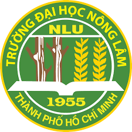
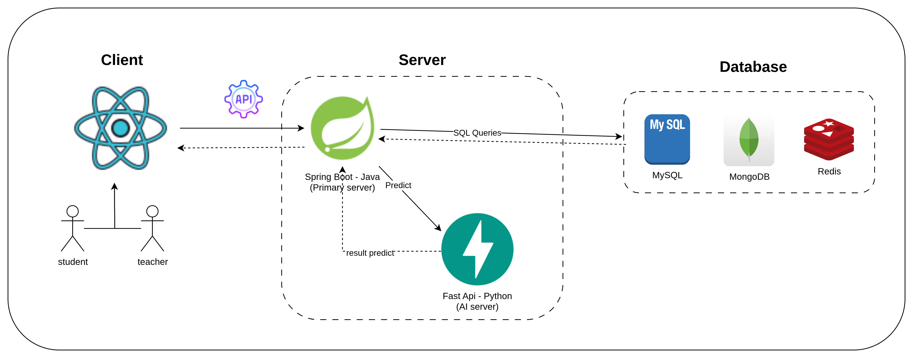

# 📋 TaskFlow: Website Manager Tasks

<br />
<div align="center">
    
    
    
    <h3>📝 TaskFlow - Website Manager Tasks</h3>
    <p align="center">
        Built for Khóa luận tốt nghiệp 2024 - 2025
    </p>
</div>
<br />

## 📑 Table of Contents

- [📌 About](#-about)
  - [📄 Đề tài](#-đề-tài)
  - [🎯 Nhiệm vụ](#-nhiệm-vụ)
  - [📚 Nội dung](#-nội-dung)
  - [📜 Thesis Title](#-thesis-title)
  - [🎯 Objectives](#-objectives)
  - [📏 Scope](#-scope)
- [⚙️ Technologies and Frameworks](#️-technologies-and-frameworks)
- [🏗 Development Architecture](#-development-architecture)
- [🗂 Folder Structure](#-folder-structure)
- [🚀 Getting Started](#-getting-started)
  - [🐳 Run with Docker](#-run-with-docker)
- [📞 Contact](#-contact)

## 📌 About

### 📄 Đề tài

Nghiên cứu sử dụng AI trong việc cải thiện hiệu suất tiến độ công việc dành cho sinh viên NLU theo phương pháp Agile/Scrum

**👩‍🏫 Giảng viên hướng dẫn**: TS. Ngyễn Thị Phương Trâm

**👨‍🎓 Sinh viên thực hiện**:

- Đặng Minh Tấn - 21130171
- Lê Anh Đức - 21130320

### 🎯 Nhiệm vụ

Nghiên cứu tích hợp các thuật toán AI vào phương pháp Scrum để tạo ra các mô hình có khả năng dự đoán và tối ưu hóa quá trình phân bổ nguồn lực. Sau đó, áp dụng để quản lý quá trình làm dự án của sinh viên khoa Công nghệ thông tin NLU.

### 📚 Nội dung

- Nghiên cứu về triết lý Agile và phương pháp Scrum.
- Nghiên cứu các chức năng điều kiện cần thiết để phát triển một website quản lý công việc.
- Ứng dụng các mô hình máy học để hỗ trợ quản lý và cải thiện hiệu suất công việc của sinh viên thông qua các yếu tố đặc trưng của những lần sprint và issue.
- Đánh giá tính khả thi của việc tích hợp các mô hình máy học vào các công cụ quản lý dự án cho sinh viên.

---

### 📜 Thesis Title

Research on Applying Artificial Intelligence to Improve Work Progress Efficiency for NLU Students Using the Agile Methodology

**👩‍🏫 Supervisor**: Dr. Nguyễn Thị Phương Trâm

**Authors:**

- Đặng Minh Tấn – 21130171
- Lê Anh Đức – 21130320

### 🎯 Objectives

Research and integrate AI algorithms into the Scrum methodology to create models capable of predicting and optimizing resource allocation. The outcome will be applied to manage the project workflows of students in the Faculty of Information Technology at NLU.

### 📏 Scope

- Study the philosophy of Agile and the Scrum methodology.
- Research the essential functional requirements for developing a task management website.
- Apply machine learning models to support the management and improvement of student work efficiency, focusing on characteristic factors from sprints and issues.
- Evaluate the feasibility of integrating machine learning models into project management tools for students.

## ⚙️ Technologies and Frameworks

- **Language**: Java 23, Nodejs v22.13.1
- **Frontend**: Typescript, ReactJS, Shadcn UI, Zod schema validation
- **Backend**: Spring Boot, Spring JPA, Spring Security, FastAPI (AI)
- **Database**: MySQL, Redis, MongoDB
- **Other**: Docker, Makefile, Cloudinary (Storage Resource)

## 🏗 Development Architecture



## 🗂 Folder Structure

```bash
.
├── AI/             # FastAPI server (contain model)
├── client/         # Front end ReactJS
├── database/       # Database service manager (dump and restore)
├── docker/         # Docker compose to run all service
│   └── deployment/
├── resource/       # Container dataset reality for model AI
├── server/         # Spring Boot server
├── swagger/        # Swagger Document

```

## 🚀 Getting Started

### 🐳 Run with Docker

1. Clone the repo

   ```bash
   git clone git@github.com:tandang2003/KLTN-Agile-Scrum-Tuan-Duc.git KLTN
   cd KLTN
   ```

2. Move to docker folder
   ```bash
   cd ./docker/deployment
   ```
3. Setup env inn `.env`

   Copy and configure your environment variables as needed.

4. Run docker compose
   ```bash
   docker compose up -d --build
   ```

📞 Contact

- **Author:** [Dang Minh Tan](https://github.com/tandang2003) & [Le Anh Duc](https://github.com/ducvui2003)
- **License:** MIT
- **Repository:** [github.com/tandang2003/KLTN-Agile-Scrum-Tuan-Duc](https://github.com/tandang2003/KLTN-Agile-Scrum-Tuan-Duc)

---

<p align="center">
  <sub>
    Built with ❤️ by <a href="https://github.com/tandang2003">Dang Minh Tan</a> and  <a href="https://github.com/ducvui2003">Le Anh Duc</a> • MIT License
  </sub>
</p>
